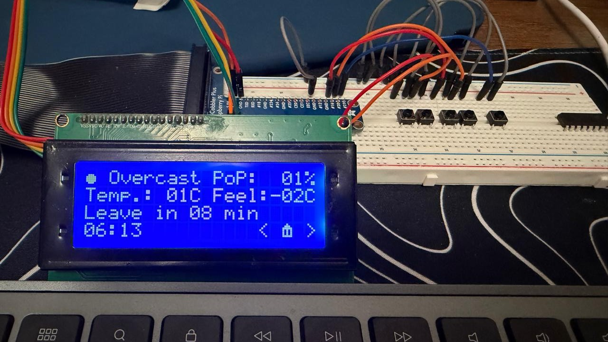
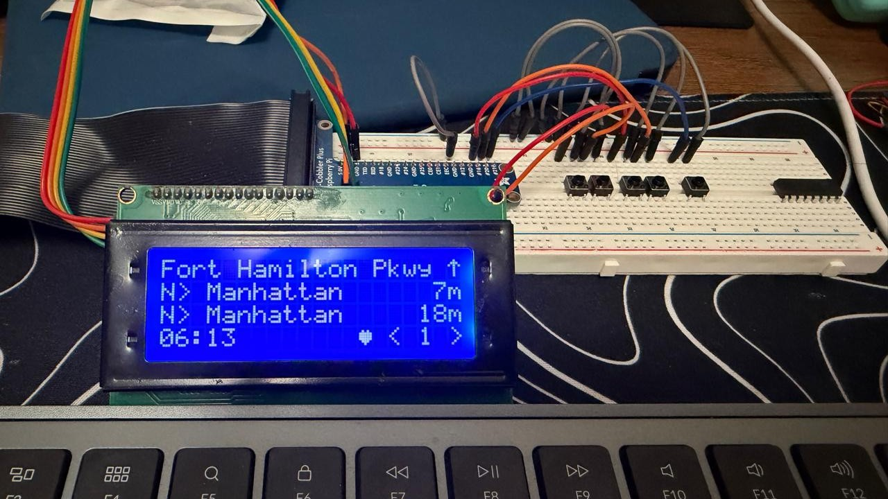

# 🗽 MTA Train Updates Display (Raspberry Pi + 20x4 LCD)

Real-time NYC subway arrival display built using:

* 🧠 Raspberry Pi Zero 2W
* 📟 20x4 I2C LCD
* 🔘 5 physical buttons
* 🌤 Live weather integration
* 🌐 Built-in web configuration server
* 🚆 MTA GTFS-Realtime API

Designed as a compact, always-on home subway dashboard.

---

# ✨ Features

* Real-time MTA train arrivals (no API key required)
* Multi-station support
* Long-press to mark favorite station
* Smart "Leave in X min" logic
* Configurable walking buffer time
* Live weather (Open-Meteo)
* Temperature unit switch (C / F)
* WiFi manager via LCD UI
* Web interface to edit monitored stations
* Fully cyclic UI navigation
* Zero UI lag (threaded background workers)

---

# 🖥 Hardware Required

| Component              | Description                   |
| ---------------------- | ----------------------------- |
| Raspberry Pi Zero 2W   | Main controller               |
| 20x4 I2C LCD (PCF8574) | 0x27 default address          |
| 5 Push Buttons         | LEFT, RIGHT, SELECT, UP, DOWN |
| Jumper wires           | Female-Female                 |
| MicroSD Card           | Raspberry Pi OS Lite          |

---

# 🔌 Wiring Connections

## 📟 20x4 I2C LCD → Raspberry Pi Zero 2W

| LCD Pin | Pi Pin | GPIO        |
| ------- | ------ | ----------- |
| VCC     | Pin 2  | 5V          |
| GND     | Pin 6  | GND         |
| SDA     | Pin 3  | GPIO2 (SDA) |
| SCL     | Pin 5  | GPIO3 (SCL) |

Enable I2C:

```bash
sudo raspi-config
# Interface Options → I2C → Enable
```

Confirm address:

```bash
sudo i2cdetect -y 1
```

Expected: `0x27`

---

## 🔘 Buttons → Raspberry Pi (BCM mode)

Buttons use **internal pull-up**, so connect one side to GPIO and the other to GND.

| Function | GPIO   | Physical Pin |
| -------- | ------ | ------------ |
| LEFT     | GPIO16 | Pin 36       |
| RIGHT    | GPIO20 | Pin 38       |
| SELECT   | GPIO21 | Pin 40       |
| UP       | GPIO19 | Pin 35       |
| DOWN     | GPIO26 | Pin 37       |

Press = connects GPIO to GND.

---

# 🧠 Software Architecture

```
app.py
 ├── Monitor (MTA feed polling thread)
 ├── WeatherWorker (Open-Meteo thread)
 ├── LCDUI (all rendering)
 ├── Buttons (event queue)
 ├── WiFi Manager (nmcli wrapper)
 └── WebConfigServer (Flask-like lightweight HTTP server)
```

All heavy operations run in background threads to keep UI responsive.

---

# 📦 Installation (Raspberry Pi OS Lite)

## 1️⃣ Update System

```bash
sudo apt update
sudo apt upgrade -y
```

---

## 2️⃣ Install Required Packages

```bash
sudo apt install python3-pip python3-venv git i2c-tools network-manager -y
```

Enable NetworkManager:

```bash
sudo systemctl enable NetworkManager
sudo systemctl start NetworkManager
```

---

## 3️⃣ Clone Repository

```bash
git clone https://github.com/RonishNadar/mta-train-updates.git
cd mta-train-updates
```

---

## 4️⃣ Create Virtual Environment

```bash
python3 -m venv .venv
source .venv/bin/activate
```

---

## 5️⃣ Install Python Dependencies

```bash
pip install -r requirements.txt
```

If no requirements file:

```bash
pip install requests RPLCD
```

---

# 🚀 Running the App

```bash
source .venv/bin/activate
python3 app.py
```

---

# ⚙️ settings.json Configuration

Example:

```json
{
  "app": {
    "poll_interval_sec": 30,
    "print_limit": 6,
    "run_for_sec": 0,
    "http_timeout_sec": 12,
    "favorite_station_index": 0,
    "leave_buffer_min": 10,
    "temp_unit": "C"
  },
  "stations": [
    {
      "stop_name": "Fort Hamilton Pkwy (N)",
      "gtfs_stop_id": "N03",
      "direction": "N",
      "direction_label": "Manhattan",
      "feed": "NQRW",
      "run_for_sec": 0
    }
  ]
}
```

---

# ❤️ Favorite Station

* Navigate to a station page
* Hold SELECT for 3 seconds
* Heart appears on bottom row
* Home page now shows:

  * "Leave in X min"
  * Automatically uses next train if current one is too soon

---

# 🌤 Weather (No API Key Needed)

Uses:

* Open-Meteo API
* Auto refresh every 10 minutes
* Shows:

  * Weather condition + icon
  * Chance of precipitation (PoP)
  * Temp + Feels Like
  * Configurable °C / °F

---

# 🌐 Web Configuration

Open from same WiFi network:

```
http://<raspberry_pi_ip>:8088
```

Edit monitored stations live.
Press SELECT on Web page to reload without reboot.

---

# 🧭 UI Navigation

| Button           | Action            |
| ---------------- | ----------------- |
| LEFT / RIGHT     | Cycle pages       |
| SELECT           | Enter / Refresh   |
| SELECT (hold 3s) | Set favorite      |
| UP / DOWN        | Navigate settings |

All pages are cyclic.

---

# 🏠 Home Screen

Displays:

* Weather icon + condition
* PoP (fixed width formatting)
* Temperature (2-digit formatted)
* Feels like
* Leave countdown logic
* Time
* Home icon

---

# 🔁 Auto-start on Boot (Optional: systemd)

If you want the app to start automatically when the Raspberry Pi boots, you can create a **systemd service**.

> Note: This assumes your virtual environment is in **`/home/pi/github/.venv`** and the repo is in **`/home/pi/github/mta-train-updates`**.

## 1️⃣ Create the service file

```bash
sudo nano /etc/systemd/system/mta-train-updates.service
```

Paste:

```ini
[Unit]
Description=MTA Train Updates LCD App
After=network-online.target
Wants=network-online.target

[Service]
Type=simple
User=pi
WorkingDirectory=/home/pi/github/mta-train-updates
Environment=PYTHONUNBUFFERED=1
ExecStart=/<code-directory>/.venv/bin/python /<code-directory>/mta-train-updates/app.py
Restart=always
RestartSec=2

[Install]
WantedBy=multi-user.target
```

Save and exit.

## 2️⃣ Enable and start

```bash
sudo systemctl daemon-reload
sudo systemctl enable mta-train-updates.service
sudo systemctl start mta-train-updates.service
```

## 3️⃣ Check status / logs

```bash
sudo systemctl status mta-train-updates.service
journalctl -u mta-train-updates.service -f
```

## 4️⃣ Reboot test

```bash
sudo reboot
```

## Optional: add a startup delay (if WiFi isn’t ready)

Edit the service:

```bash
sudo nano /etc/systemd/system/mta-train-updates.service
```

Add this line inside `[Service]`:

```ini
ExecStartPre=/bin/sleep 5
```

Then reload + restart:

```bash
sudo systemctl daemon-reload
sudo systemctl restart mta-train-updates.service
```

## Disable auto-start (if needed)

```bash
sudo systemctl disable --now mta-train-updates.service
```

---

# 📸 Images

<p float="center">
  
  
  
</p>

---

# 🛠 Future Improvements

* Auto dim at night
* Animated weather icons
* MQTT integration
* Wall mount enclosure
* Battery + UPS support
* Multiple favorites
